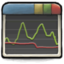

  

# Performance Monitor

A simple, interactive Windows performance monitor built with Electron.

## Features

- **Real-time metrics**: CPU, Memory, Disk, Network usage
- **Historical charts**: 60-second rolling history with smooth animations
- **Per-core CPU monitoring**
- **Top processes by CPU usage**
- **System information display**

